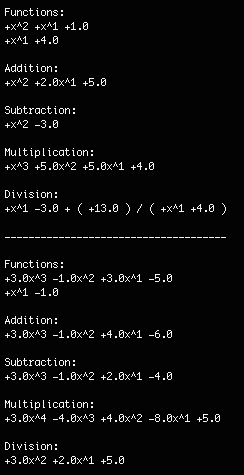

#Polynomial Arithmetic

###A Haskell module that provides functions for performing arithmetic operations on polynomial functions. Because math and Haskell are cool, and this gave me a reason to work with both.

Polynomials are represented by the `Polynomial` record type (declared in Polynomial.hs) which consists of `Variable` record types (declared in Variable.hs). These two modules are required for the PolynomialOperations module.

PolynomialOperations.hs contains the functions for polynomial addition, subtraction, multiplication, and division (each function accepts two Polynomials as operands). Main.hs contains a main function that performs all arithmetic operations on two sets of functions.

In the future, I hope to make it possible to accept ASCIIMath input from the console and translate it to a `Polynomial` record type. But unfortunately for now, the only way to test out your own functions is to hard code them in the main function. Examples of this can be seen in Main.hs.

The main module has two pairs of polynomials. It takes these two pairs and performs addition, subtraction, multiplication, and division on the two polynomials in each. The results are printed to the console as seen below:

The resulting polynomials are always simplified. For division, polynomial reminders are represented as functions in the format of "(remainder) / (divisor)" (as shown in the first example).

Demo
-----
The project executable is provided as PolynomialArithmeticDemo.

Compile
-----
With GHC installed on a Unix-based OS, use `ghc -o PolynomialArithmeticDemo Main.hs` in terminal in the src directory.